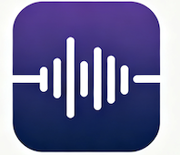

# JasListen

JasListen is a native listening app for iPhone, iPad, and Mac. It is designed for repeated language listening with local audio, saved position, playback speed, and A–B looping. Lessons live inside playlists; use a backup file to move them between devices.

## Open the native app

Open [`JasListen.xcodeproj`](JasListen.xcodeproj) in Xcode and run the **JasListen** scheme on an iOS 17 or later device/simulator, or macOS 14 or later. The project uses SwiftUI, SwiftData, AVFoundation, and ZIPFoundation. The first build resolves ZIPFoundation through Swift Package Manager.

## First release

- Import MP3 and other audio files supported by AVFoundation — one file, several files at once, or a whole folder searched recursively — then play, pause, seek, and change speed. On Mac, files and folders can also be dropped onto the playlist sidebar. Audio added with no playlist selected is filed in a playlist named `Imported`.
- Playlists are how you browse: create, rename, reorder, and play them in manual, name, or recently-added order. A lesson can appear in more than one playlist without being stored twice.
- Removing a lesson from a playlist keeps its audio; "Delete Audio File…" is a separate action that warns when other playlists still use it.
- Resume each lesson from its last saved position and repeat an A–B range.
- On Mac, press space to play or pause the loaded lesson, and use ← and → to move back and forward 10 seconds. Text fields and sheets keep their normal keys.
- On iPhone and iPad, continue playback in the background and use system media controls.
- Export and restore `.stillbackup` archives containing lesson data, playlists, and audio. Restore merges lessons and playlists and remaps conflicting IDs.
- Import the existing web player's `still-listening-backup` v1 JSON export, including its Base64 audio.
- There is no account, backend, or automatic device sync.

Transcripts, bookmarks, and focused practice are later milestones. See [PLANS.md](PLANS.md) for architecture and acceptance criteria.

## Web migration source

The original static web player (`index.html`, `styles.css`, and `app.js`) is retained temporarily so its existing v1 backups can be created and migrated. Do not remove it until native import and acceptance checks pass on both platforms.

## Local data

SwiftData stores lesson metadata and progress. Audio files remain in the app's `Application Support/Still/Audio` folder so existing lesson records continue to resolve after the product rename. Data remains on the current device unless manually included in a backup and moved by the user. A lesson that no playlist has claimed is filed in the `Imported` playlist the next time the app opens or a backup is restored.

# V1.0 
## Improvements
1. UI and layout are not beautiful or good enough on iOS (not full screen, ugly background color). Some elements look like too large compared to other apps.
2. auto switch to next one when finish playing current audio. auto switch to the first audio when finish palying the last one. 
3. playlist management, edit and name a playlist. switch among different playlists. 
4. auto-play when click any audio of the playlist. 
5. Volume adjustment. 

- audios should be ordered by name/time (allow switching) on playlist. 
- when playing audios on playlist, didn't show the playing page where users can modify speed, loop and so on.
- the playing progress didn't reset after playing to the end.

- show current play queue or playlist on the same playing page. 
- make the playing page neat and compact or tighter. 

# V2.0
1. smart sentences segmentation.  
2. one-shot generating subtitles, language support: English, Finnish. 
